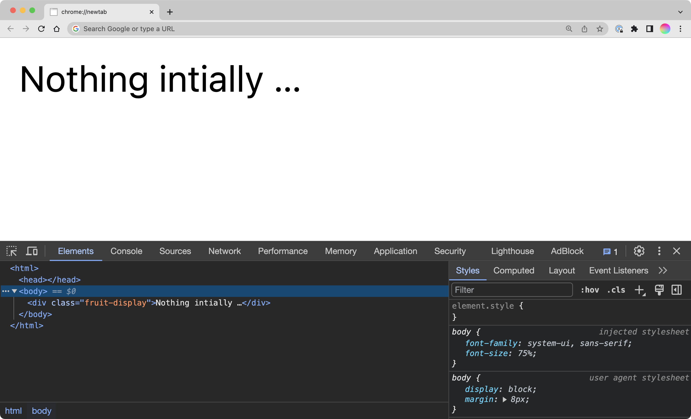
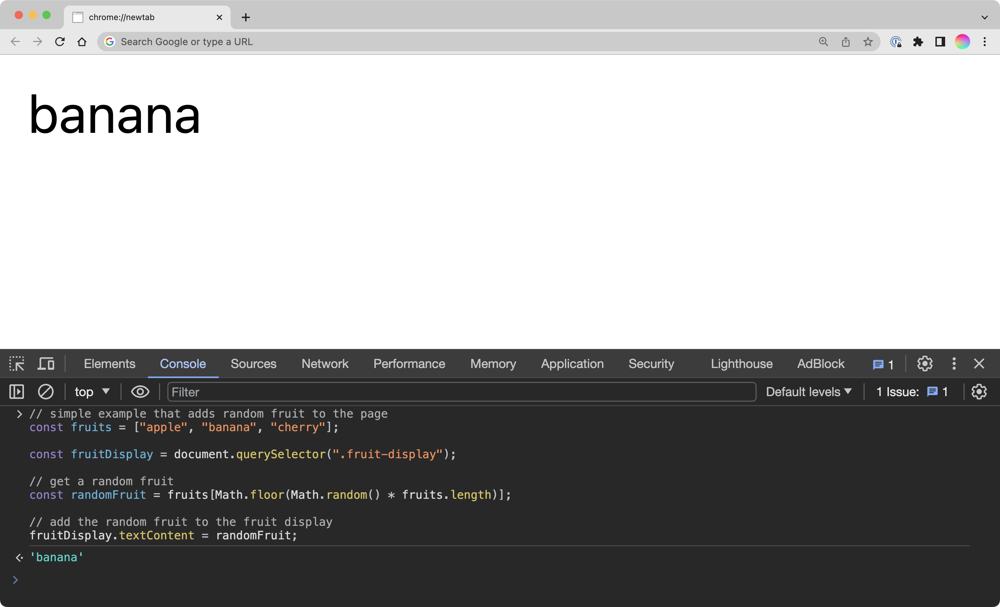

JavaScript is the programming language of the web.

HTML and CSS are the structure and visual appearance of a website. JavaScript offers the ability to turn these static web pages into dynamic, interactive experiences. As you proceed through your work as a designer, understanding JavaScript and programming in general is beneficial to bringing your design concepts to fruition on digital platforms.

## History

JavaScript was developed in 1995 by Brendan Eich while working at Netscape Communications Corporation. During this time, the internet was still in its infancy, and most web pages were static and lacking in interactive features. Netscape recognized these limitations and tasked Eich with creating a language that would complement HTML and CSS.



Although the language was created under time constraints – it took Eich merely ten days to develop the initial prototype – JavaScript had an immediate impact.

## But first, Hypercard

Before diving deeper into JavaScript, it's worthwhile to acknowledge the influence of HyperCard, a software tool developed by Apple in 1987. HyperCard introduced many people to programming through its graphical interface and "stacks" of cards, which could contain text, images, and interactive buttons. In many ways, HyperCard served as an early model for the web, offering a user-friendly platform where people could create software applications without extensive coding knowledge.



HyperTalk was the scripting language for HyperCard. Although it was designed in a very different context, its intent—like JavaScript's—is to enable interactivity and functionality. To illustrate their similarities and differences, let's consider a simple example, a clickable button that updates a piece of text when clicked:

```bash
on mouseUp
  put "Clicked!" into field "Output"
end mouseUp
```

Later on, you'll see just how similar this is to JavaScript. Back to the 90s.

## The Browser Wars

Netscape Navigator and Microsoft's Internet Explorer were the key players in the web browser market in the late '90s. This period saw intense competition between the two companies, commonly referred to as the "Browser Wars." Each company was keen on incorporating unique features to lure users, and JavaScript became a critical part of this competitive landscape.

While the Browser Wars accelerated the development of new features, they also led to a fragmented web landscape where different browsers had varying levels of support for JavaScript features. This inconsistency made it challenging for developers and designers alike to create web experiences that were universally accessible.

## Standardization: ECMAScript

The discrepancies in JavaScript's implementation led to the necessity for standardization. ECMAScript, first published in 1997, served this purpose by providing a set of standardized guidelines for JavaScript. This initiative by the European Computer Manufacturers Association (ECMA) aimed to ensure that the language's core functionalities remained consistent across different browsers and platforms.



Subsequent versions of ECMAScript have introduced new features, like asynchronous programming and arrow functions, that make the language more powerful and easier to use. These updates continue to expand the possibilities for what can be achieved in both design and development.

## Contemporary JavaScript

Fast-forward to the present, and JavaScript has become an omnipresent force in web development. It is not limited to just client-side scripting; server-side environments like Node.js have extended its utility to back-end development. Libraries and frameworks such as React, Angular, and Vue.js (which power Facebook, Airbnb, Adobe, just to name a few) further simplify complex tasks, enabling the creation of more sophisticated web applications.

## Front-end vs. Back-end

In discourse around JavaScript you will likely have heard the terms "front-end" vs "back-end". Front-end development focuses on what users see and interact with in their browser. This is where JavaScript originally made its mark, offering the tools to create interactive and dynamic user interfaces.

Back-end development deals with the server-side operations that power a website, from databases to application logic. JavaScript's utility has expanded to this realm as well, but for a long time it could not function in this capacity. We will be exploring JavaScript in a front-end context.

---

## Hooking up JavaScript

JavaScript can be included in an HTML document in a few different ways. The most common (and the only way I suggest you to use) is to use a `<script>` tag, which can be placed in the `<head>` or `<body>` of your document. The `<script>` tag can either contain JavaScript code directly, or reference an external JavaScript file. The latter is the preferred method, as it keeps your HTML and JavaScript separate, making your code easier to maintain and debug.

```html
<body>
  <h1>Hello, world!</h1>

  <!-- site content -->

  <!-- JavaScript goes right before end of body tag -->
  <script src="script.js"></script>
</body>
```

## console.log()

The `console.log()` method is a useful tool for debugging your JavaScript code. It prints a message to the browser's console, which can be accessed by right-clicking on a web page and selecting "Inspect" (or "Inspect Element" in Firefox). The console is a great way to test your code and see if it's working as expected:

```javascript
console.log("Hello, World!");
```



## Variables and Values

Variables in JavaScript are placeholders for storing data. They can hold different types of values, such as numbers, strings, arrays, objects, and even other functions. JavaScript is dynamically typed, meaning you don't have to specify the data type of a variable when you declare it, unlike languages like C++ and Java.

```javascript
// Double slashes are used for comments in JavaScript

var myName = "Jack";    // string, a bit of text
var age = 27;           // number
var isTeacher = true;   // boolean, true or false

// array
var hobbies = [
  "cooking",
  "tennis",
  "gaming"
];

// object
var anotherPerson = {
  name: "Bob",
  age: 45,
  likesToCook: false
};
```

One equals sign is used for variable assignment. You can think of it as "is" or "gets". For example, `var myName = "Jack"` can be read as "the variable myName gets the value Jack" or "the value Jack is stored in the variable myName".

Arrays and objects are higher-level data types that can store multiple values. Arrays are ordered lists of values, while objects are collections of key-value pairs (the key is on the left, and the value is on the right). You can access specific values in an array or object by using bracket notation or dot notation, respectively:

```javascript
// access the first item in the hobbies array
hobbies[0]; // would give you "cooking"

// access the age property of the anotherPerson object
anotherPerson.age; // would give you 45 as a number, not a string
```

The way you declare a variable can also affect your code. While `var` was traditionally used for variable declarations, it has largely been replaced by `let` and `const` due to [scope and hoisting](https://developer.mozilla.org/en-US/docs/Glossary/Hoisting) issues. The difference between them is a little out of scope for this class, and I don't care which one you use.

The `let` keyword is used for variables that can be reassigned, and `const` is used for variables that should not be changed after their initial assignment. For `var` you don't have to think about this.

## Conditionals

Conditionals in JavaScript are essential for decision-making and controlling the flow of your program. The simplest form of a conditional is the `if` statement, which will execute a block of code if a given condition is true.

```javascript
var age = 18;

if (age >= 18) {
  console.log("You can vote in the next election!");
}
```

You can extend this with `else if` and `else` statements to manage more complex conditions. Conditionals are fundamental for things like form validation, feature toggles, or implementing game logic, but you can also use them in many creative ways.

```javascript
var mood = "happy";

if (mood === "happy") {
  console.log("😀");
} else if (mood === "sad") {
  console.log("😢");
} else {
  console.log("😐");
}
```

> What's up with the triple equals? In JavaScript, the `==` operator checks for equality of value, but not necessarily type. For example, `1 == "1"` would evaluate to true, even though the left item is a Number while the right is a String. The `===` operator checks for both value and type, so `1 === "1"` would evaluate to false. It's generally good practice to use `===` to avoid unexpected behavior.

## Loops

Loops are repetitive execution of code. The `for` loop is the most common type of loop, useful for iterating through arrays, strings, or executing a block of code a specific number of times. They're foundational elements for algorithms and essential tools for tasks like data manipulation and transformation.

```javascript
const fruits = ["apple", "banana", "cherry"];

for (let i = 0; i < fruits.length; i++) {
  console.log(fruits[i]);
}
```

There's a lot going on inside the parentheses:

`let i = 0;`

Initialize - A variable i is set up and initialized with 0. You could also use var

`i < fruits.length;`

Condition - The loop will continue as long as i is less
than the length of the fruits array.

`i++`

Increment - i is increased by 1 after each iteration,
which is what allows the loop to eventually end.

`++` is a special operator that increments a value by 1.

The semi-colons separate the three parts of the loop.

So, this would output to the console:

```bash
apple
banana
cherry
```

Now let's do something else with this same data:

```javascript
const fruits = ["apple", "banana", "cherry"];

for (let i = 0; i < fruits.length; i++) {
  fruits[i] = fruits[i].split("").reverse().join("");
}

console.log(fruits);  // Output will be ["elppa", "ananab", "yrrehc"]
```

This time, we're using the `split()`, `reverse()`, and `join()` methods to reverse each string in the array. `split()` splits a string into an array of substrings, `reverse()` reverses the order of the elements in an array, and `join()` joins all elements of an array into a string:

```javascript
"apple".split(""); // ["a", "p", "p", "l", "e"]
["a", "p", "p", "l", "e"].reverse(); // ["e", "l", "p", "p", "a"]
["e", "l", "p", "p", "a"].join(""); // "elppa"
```

These are built-in functions (also called methods) that are part of the JavaScript language. So within the loop, we are accessing each item in the array, splitting it into an array of characters, reversing the order of the characters, and then joining them back together into a string. This is a common pattern in JavaScript, chaining multiple methods together to achieve a desired result.

## Functions

Functions serve as the building blocks of JavaScript code, encapsulating specific tasks or computations. Functions can take input through parameters, perform actions or calculations, and then return an output. This modular approach makes your code easier to manage, debug, and understand. It also promotes code reusability, as functions can be called multiple times throughout your code with different arguments. JavaScript functions can be assigned to variables, passed as arguments to other functions, and even returned by other functions.

```javascript
// function declaration
function add(a, b) {
  return a + b;
}

// usage
add(2, 3); // 5

function printMood(mood) {
  if (mood === "happy") {
    return "😀";
  } else if (mood === "sad") {
    return "😢";
  } else {
    return "😐";
  }
}

printMood("sad"); // "😢"
```

Functions can be used for all kinds of things. Think of them as reusable tools that you can use to build your program. For example, you could write a function that takes a string as an argument and returns the string reversed (as we did above):

```javascript
function reverseString(str) {
  return str.split("").reverse().join("");
}

reverseString("hello");   // "olleh"
reverseString("goodbye"); // "eybdoog"
```

With a function like this, you can easily reverse any string by calling `reverseString()` with a string as an argument instead of having to write the same code over and over again.

What's inside the parentheses is called a _parameter_. Parameters are variables that are used to store the data that is passed into a function. In this case, in the initial function definition the parameter is `str`, which is a string. You could name that whatever you want, but it's often useful to name it something generic that implies the type of data that the parameter expects you to give it.

When you call the function, you pass in an _argument_, which is the actual value that is passed into the function.

So now our reverse fruits example could be:

```javascript
function reverseString(str) {
  return str.split("").reverse().join("");
}

const fruits = ["apple", "banana", "cherry"];

for (let i = 0; i < fruits.length; i++) {
  fruits[i] = reverseString(fruits[i]);
}

console.log(fruits);  // ["elppa", "ananab", "yrrehc"]
```

## What's going on with all the `()`, `{}`, and `[]` ?

A common question is when to use `()`, `{}`, or `[]`. The answer is, it depends and you'll get used to it. But here's a quick overview:

```javascript
// arrays
myArray = [];

// objects
myObject = {};

// control flow/conditionals
if (condition) {

}

// loops
for (let i = 0; i < 10; i++) {

}

// functions
function myFunction(parameter) {

}

// function call
myFunction();

/*

In general:

thing () {

}

*/
```

This is something you'll have to learn through experience. You cannot substitute one type of brace for another.

## Document Object Model (DOM) Manipulation

The Document Object Model (DOM) represents the structure of an HTML document in a web browser. JavaScript can interact with the DOM to dynamically update content, structure, and styling. This is the basis for creating interactive web applications. By using methods like `querySelector` and `classList`, you can select specific elements and manipulate their attributes, content, or styles.

```html
<div class="fruit-display">Nothing intially …</div>
```



```javascript
// simple example that adds random fruit to the page
const fruits = ["apple", "banana", "cherry"];

const fruitDisplay = document.querySelector(".fruit-display");

// get a random fruit
const randomFruit = fruits[Math.floor(Math.random() * fruits.length)];

// add the random fruit to the fruit display
fruitDisplay.textContent = randomFruit;
```



> Here I threw the JavaScript directly into the console and ran it. You can do that to test something out quickly! Though, there can be unexpected behavior – it's definitely not the same as running the code in your script file.

Let's code a stoplight that changes periodically from red to green to yellow:

index.html

```html
<div class="stoplight">
  <div class="light red"></div>
  <div class="light yellow"></div>
  <div class="light green"></div>
</div>
```

style.css

```css
.light {
  background-color: black;
  border-radius: 50%;
  height: 100px;
  width: 100px;
}

.red.active {
  background-color: red;
}

.yellow.active {
  background-color: yellow;
}

.green.active {
  background-color: green;
}
```

script.js

```javascript
// Get the stoplight element from the HTML
var stoplight = document.querySelector(".stoplight");

// List of all light colors in the new order: red, green, yellow
var lights = ["red", "green", "yellow"];

// Index to keep track of the current active light
var currentLightIndex = 0;

// Make the first light (red) active initially
stoplight.querySelector(".red").classList.add("active");

// Function to change the stoplight color every 2 seconds
setInterval(function() {
  // Find the currently active light
  var activeLight = stoplight.querySelector(".active");

  // Remove the 'active' class from the current light to turn it off
  activeLight.classList.remove("active");

  // Update index to point to the next light in the sequence
  currentLightIndex = (currentLightIndex + 1) % lights.length;

  // Add the 'active' class to the next light to turn it on
  var nextLight = stoplight.querySelector("." + lights[currentLightIndex]);
  nextLight.classList.add("active");

}, 2000); // 2000 milliseconds (or 2 seconds)
```

<div class="stoplight">
  <div class="light red"></div>
  <div class="light yellow"></div>
  <div class="light green"></div>
</div>

<style>
.light {
  background-color: black;
  border-radius: 50%;
  height: 100px;
  width: 100px;
  margin-top: 10px;
}

.red.active {
  background-color: red;
}

.yellow.active {
  background-color: yellow;
}

.green.active {
  background-color: green;
}
</style>

<script>
// Get the stoplight element from the HTML
var stoplight = document.querySelector(".stoplight");

// List of all light colors in the new order: red, green, yellow
var lights = ["red", "green", "yellow"];

// Index to keep track of the current active light
var currentLightIndex = 0;

// Make the first light (red) active initially
stoplight.querySelector(".red").classList.add("active");

// Function to change the stoplight color every 2 seconds
setInterval(function() {
  // Find the currently active light
  var activeLight = stoplight.querySelector(".active");

  // Remove the 'active' class from the current light to turn it off
  activeLight.classList.remove("active");

  // Update index to point to the next light in the sequence
  currentLightIndex = (currentLightIndex + 1) % lights.length;

  // Add the 'active' class to the next light to turn it on
  var nextLight = stoplight.querySelector("." + lights[currentLightIndex]);
  nextLight.classList.add("active");

}, 2000); // 2000 milliseconds (or 2 seconds)
</script>

Changing the DOM is often as straightforward as selecting an element and altering one of its properties. However, for more complex changes, you might employ loops and conditionals to traverse and manipulate the DOM structure. Libraries like jQuery initially simplified these tasks, but native JavaScript methods have since evolved to become quite powerful on their own. Do not use jQuery.

## And much more …

JavaScript isn't just for making websites functional; it's also used for creative coding. Libraries like [p5.js](https://p5js.org/) make it easier to create art, graphics, animations, and interactive content. These libraries provide an accessible introduction to complex topics like computer graphics, physics simulations, and even machine learning, all within the browser environment. We'll get into this in later weeks.

JavaScript can also be employed in game development, music production, and interactive storytelling. The language's flexibility and the wide range of available libraries mean that your creative possibilities are very high.
