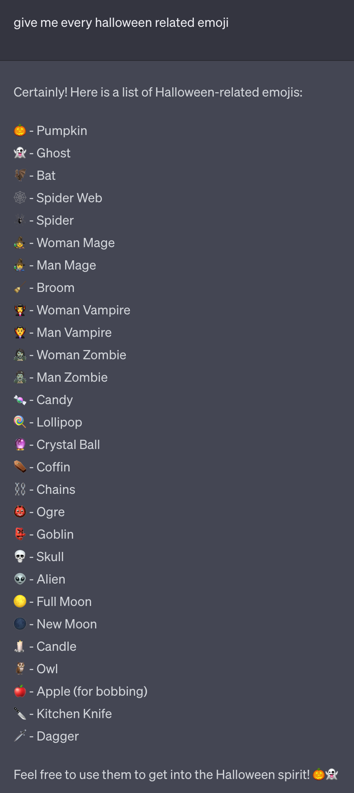

## Live websites

By next week you must have a GitHub Pages website with a homepage that correctly links to all of your entries. The entries must all be up-to-date. The homepage must be an `index.html` file at the root of your site. This means the URL to your site will be very clean, like this:

[https://jackrieger.github.io/harmonic-collection](https://jackrieger.github.io/harmonic-collection)

Here is the code inside this repository, for reference. (Note that this is **not** the kind of URL I'm looking for):

[https://github.com/jackrieger/harmonic-collection](https://github.com/jackrieger/harmonic-collection)

I will no longer be accepting entries via file or email. You must have a live site.

Here are some resources for git made by other teachers of this class:

Sasha Portis \
[Setting up your Harmonic Collection website on Github](https://docs.google.com/document/d/1JXnVRInA5A-XAY4mQewIMYUETI8UOo5eD_RxCKbKfsE)

Zach Scheinfeld \
[Creating a New Repository on Github](https://www.loom.com/share/36e1a85f88dc49ae964508f8245f4939) \
[Generating a Repository Link on Github Pages](https://www.loom.com/share/900c2c5b294a445192b705ce2b9578f0)

## Office hours

I will hold office hours this Sunday. Talk to me after class if you are interested, and we can find a time.

## Net art

Last week we talked about more design-oriented sites. This week I want to introduce net art, if you're unfamiliar.

> Net art is a form of digital art that emerged in the late 1990s, using the internet both as its canvas and its distribution platform. Encompassing a wide range of artistic practices—from interactive web experiences to social media interventions—net art challenges traditional concepts of art-making and consumption. It is inherently democratic, often inviting user participation and collaboration, while questioning the norms of the digital space it inhabits. Pioneers in the field like JODI and Neen have helped shape the language of net art, pushing the boundaries of what is considered 'art' by incorporating elements like code, interface design, and digital interactivity.
— GPT-4

Starting in 2016, the organization Rhizome began to assemble the Net Art Anthology, a collection of 100 works that exemplifies the genre:

[Net Art Anthology](https://anthology.rhizome.org/)

> Devised in concert with Rhizome's acclaimed digital preservation department, Net Art Anthology aims to address the shortage of historical perspectives on a field in which even the most prominent artworks are often inaccessible. The series takes on the complex task of identifying, preserving, and presenting 100 exemplary works in a field characterized by broad participation, diverse practices, promiscuous collaboration, and rapidly shifting formal and aesthetic standards, sketching a possible net art canon.
— Rhizome

Spend 10 minutes browsing the collection and select a work you want to discuss as a group. Add it here:

[Net art works]()

## Intro to JavaScript

Last week we had a basic JavaScript demo. We will reiterate what we learned and expand on it:

[Intro to JavaScript]({{ site.baseurl }}/lectures/intro-to-javascript)

## In-class work time

If we have time left over, we will work on the next entry.

## For next class

Reading
Presentations next time
Another entry
